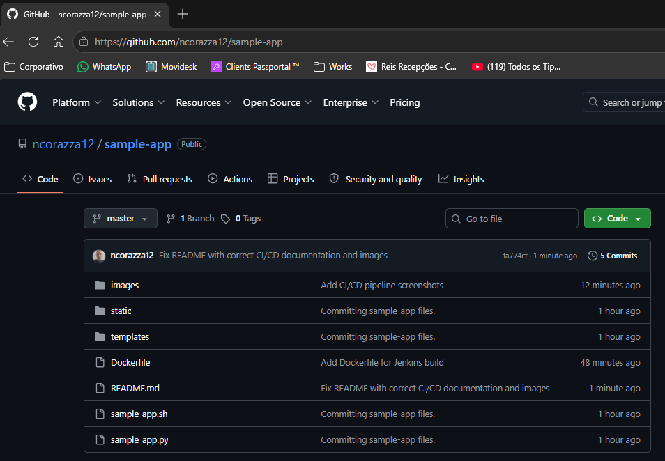
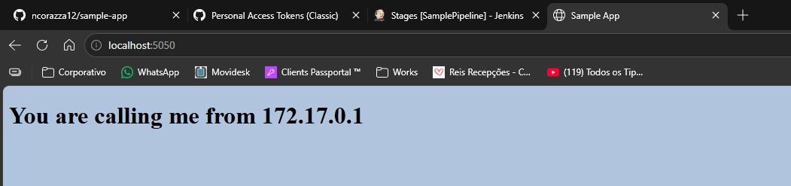
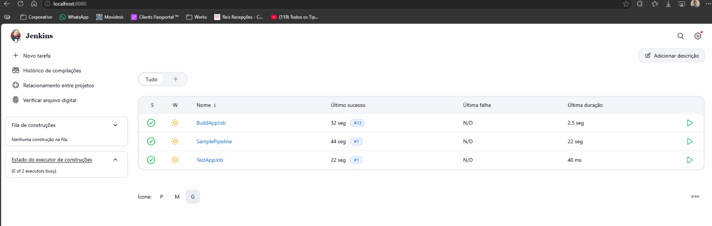
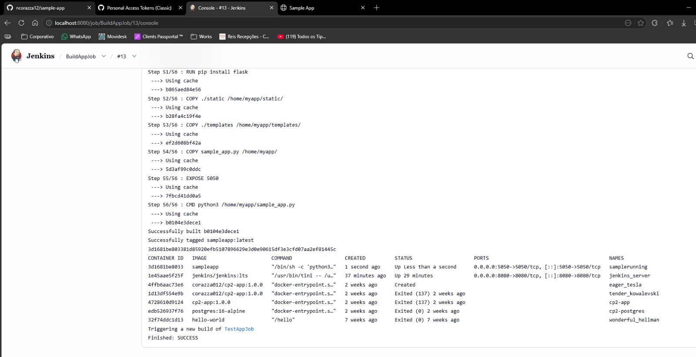
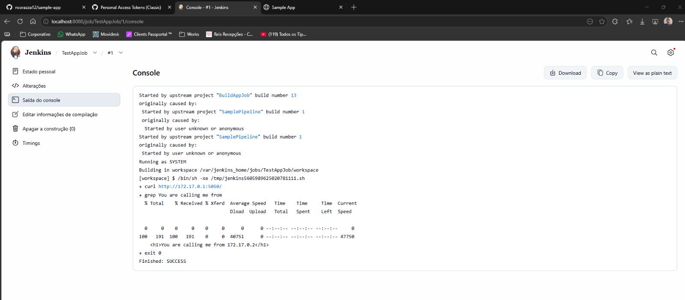
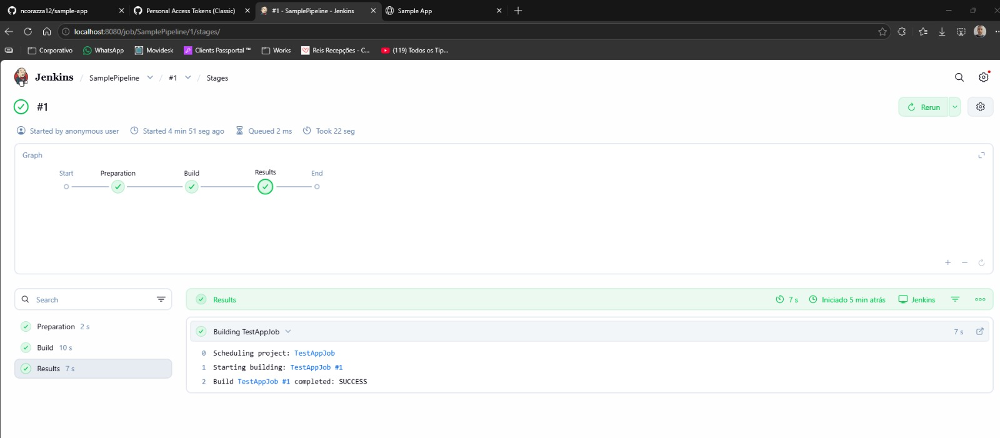

# sample-app

Aplicação de exemplo utilizada na atividade **CP2 - Pipeline CI/CD com Jenkins**.

> Disciplina: Desenvolvimento de Aplicações e Automação de Redes  
> Grupo NEXT | Entrega: 17/05/2026

---

## 📋 Sobre o Projeto

Esta aplicação Flask simples foi utilizada para demonstrar na prática a construção de um pipeline de **Integração Contínua e Entrega Contínua (CI/CD)** utilizando Jenkins, Docker e GitHub.

O pipeline automatiza o ciclo completo: a cada commit no repositório, o Jenkins clona o código, constrói um contêiner Docker com a aplicação, executa testes automatizados e valida que a aplicação está funcionando corretamente.

---

## 🗂️ Estrutura do Repositório

```
sample-app/
├── sample_app.py          # Aplicação Flask principal
├── sample-app.sh          # Script de build (cria e sobe o contêiner Docker)
├── templates/
│   └── index.html         # Página HTML da aplicação
├── static/
│   └── style.css          # Estilo da página
├── images/                # Prints de evidência da atividade
└── README.md
```

---

## ⚙️ Ambiente Utilizado

| Ferramenta | Uso |
|---|---|
| Windows 11 + WSL2 (Ubuntu) | Ambiente de desenvolvimento (substitui a VM DEVASC) |
| Docker Desktop for Windows | Execução dos contêineres (Jenkins + aplicação) |
| Jenkins (via Docker) | Servidor de CI/CD |
| GitHub | Repositório remoto de código |
| Python + Flask | Linguagem e framework da aplicação |

---

## 🚀 Como Executar a Aplicação Localmente

### Pré-requisitos
- WSL2 com Ubuntu instalado
- Docker Desktop em execução

### Passos

```bash
# 1. Clone o repositório
git clone https://github.com/SEU-USUARIO/sample-app.git
cd sample-app

# 2. Execute o script de build
bash ./sample-app.sh

# 3. Acesse no navegador
# http://localhost:5050
```

---

## 📸 Evidências da Atividade

### 1. Repositório no GitHub


---

### 2. Aplicação rodando na porta 5050


---

### 3. Jenkins confirmando app rodando


---

### 4. Console Output — BuildAppJob


---

### 5. Console Output — TestAppJob


---

### 6. Pipeline — 3 estágios verdes


---

## 🔧 Pipeline CI/CD no Jenkins

O pipeline é composto por 3 estágios:

```
┌─────────────────┐     ┌─────────────────┐     ┌─────────────────┐
│   Preparation   │────▶│      Build      │────▶│     Results     │
│                 │     │                 │     │                 │
│ Para e remove   │     │ Clona o repo    │     │ Testa se a app  │
│ contêiner       │     │ e faz o build   │     │ responde na     │
│ anterior        │     │ Docker          │     │ porta 5050      │
└─────────────────┘     └─────────────────┘     └─────────────────┘
```

### Jobs configurados no Jenkins

| Job | Tipo | Função |
|---|---|---|
| `BuildAppJob` | Freestyle | Clona o repo e executa `bash ./sample-app.sh` |
| `TestAppJob` | Freestyle | Valida a aplicação via cURL após o build |
| `SamplePipeline` | Pipeline | Orquestra os dois jobs acima em sequência |

### Script do Pipeline (Groovy)

```groovy
node {
    stage('Preparation') {
        catchError(buildResult: 'SUCCESS') {
            sh 'docker stop samplerunning'
            sh 'docker rm samplerunning'
        }
    }
    stage('Build') {
        build 'BuildAppJob'
    }
    stage('Results') {
        build 'TestAppJob'
    }
}
```

---

## 🧪 Script de Teste

O `TestAppJob` verifica automaticamente se a aplicação está respondendo com o conteúdo correto:

```bash
if curl http://172.17.0.1:5050/ | grep "You are calling me from 172.17.0.1"; then
  exit 0
else
  exit 1
fi
```

- **exit 0** → Teste passou, build bem-sucedido ✅  
- **exit 1** → Teste falhou, build marcado como erro ❌

---

## 👥 Integrantes do Grupo

- Nickolas Corazza — RM562265
- Dorivaldo Nascimento — RM565225
- Gabriel Lamata — RM562093
- Luiz Parpinelli — RM566493

---

## 📎 Referências

- [Jenkins Documentation](https://www.jenkins.io/doc/)
- [Docker Hub - jenkins/jenkins](https://hub.docker.com/r/jenkins/jenkins)
- [Flask Documentation](https://flask.palletsprojects.com/)
- Cisco NetAcad - Lab: Build a CI/CD Pipeline Using Jenkins
